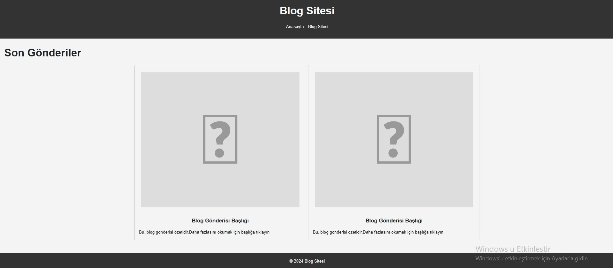
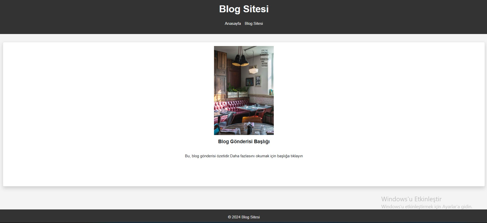

# 📝 Bootstrap Özellikleri ile Blog Sitesi

Bu proje, Patika.dev Front-End eğitimi kapsamında verilen "Bootstrap Özelliklerini Kullanarak Yaptığımız Siteyi Geliştirelim" ödevi için geliştirilmiştir. Daha önce sadece HTML ve CSS ile yapılan blog sitesi, bu çalışmada Bootstrap kullanılarak modern ve duyarlı (responsive) hale getirilmiştir.

## 🚀 Amaç

Bu projede, Bootstrap'in grid sistemi, kart yapısı (`card`), jumbotron ve diğer bileşenleri kullanılarak blog sitesinin kullanıcı arayüzü geliştirildi. Hem masaüstü hem de mobil uyumlu hale getirildi.

## 🛠️ Kullanılan Teknolojiler

- HTML5
- CSS3
- [Bootstrap 5](https://getbootstrap.com/)
- Font Awesome

## 📄 Sayfalar

### ✅ `index.html`
- Koyu renkli bir navbar içerir.
- "Son Gönderiler" başlığı altında Bootstrap `card` bileşenleri ile blog özetleri gösterilir.
- Kartlar `grid` sistemiyle eşit boyutlarda ve responsive olarak düzenlenmiştir.
- Footer alanı Bootstrap ile ortalanmış şekilde yerleştirilmiştir.

### ✅ `post.html`
- Bootstrap `card` kullanılarak blog içeriği detaylı şekilde gösterilmiştir.
- Responsive bir yapı ile içerikler ortalanmıştır.
- Görsel, başlık ve açıklama içerir.

## 🎨 Tasarım Notları

- Navbar ve footer koyu renkte düzenlenmiştir.
- Kartlardaki tüm içerikler aynı boyutta ve hizalı olacak şekilde optimize edilmiştir.
- Görseller `img-fluid` ve `object-fit: contain` ile responsive ve orantılı hale getirilmiştir.

## 📷 Ekran Görüntüleri

### Anasayfa

### Blog Detay Sayfası

### Kart Yapısı

## 📚 Öğrendiklerim

- Bootstrap grid sistemi ve kart yapısı
- Responsive tasarım uygulamaları
- Bootstrap navbar, footer ve diğer bileşenlerin kullanımı

---

🧑‍💻 Bu proje, temel Bootstrap yetkinliğini geliştirmek için hazırlanmıştır. Geliştirmeye ve yeni bileşenler denemeye açıktır.
